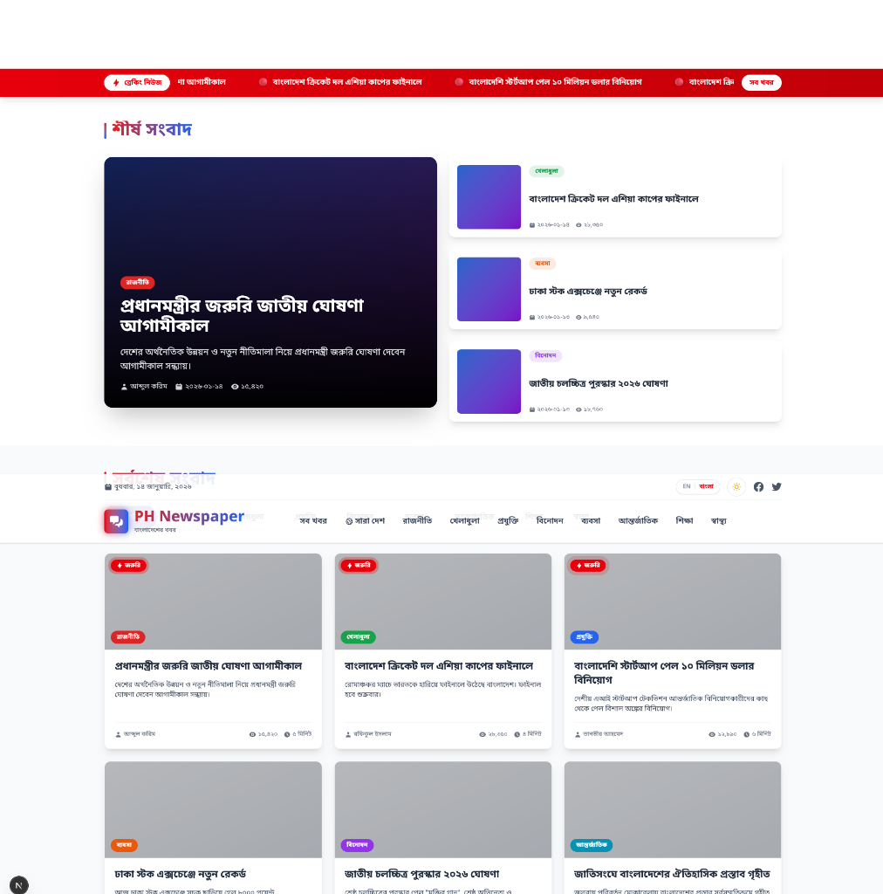
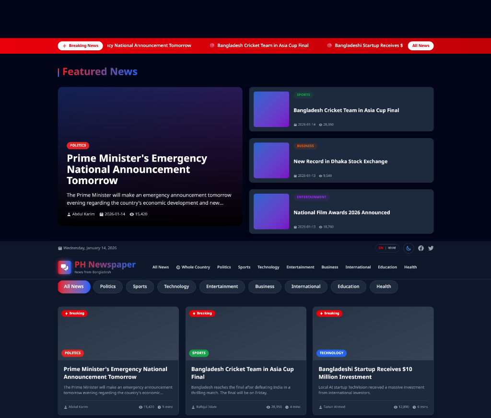

# 📰 PH Newspaper - Modern Online Portal

**PH Newspaper** is a premium, fully responsive, and bilingual news portal built for the digital age. It features real-time-like news updates, a global theme switcher, and an interactive geographical map for regional news.

Live Link: [ph-newspaper-three.vercel.app](https://ph-newspaper-three.vercel.app)

---

## 📸 Portal Preview

| Light Mode | Dark Mode |
| :---: | :---: |
|  |  |

---

## ✨ Key Features

- **🌗 Global Theme Toggle**: Seamless switching between premium Dark and Light modes with persistent state.
- **🌐 Bilingual Support**: full internationalization for English and Bangla (বাংলা), including dynamic dates and number formatting.
- **🗺️ Interactive "Sara Desh" Map**: A Geographical news interface featuring a thematic Bangladesh map with district-wise news filtering.
- **🔥 Breaking News Ticker**: A continuous scrolling ticker for urgent headlines with pause-on-hover functionality.
- **📊 Dynamic Visuals**: Real-time district statistics charts using Recharts.
- **📱 Ultra Responsive**: Optimized for everything from small mobiles to large 4K displays.
- **⚡ SEO & Performance**: High-performance rendering with Next.js App Router and dynamic metadata.

---

## 🛠️ Technology Stack

| Technology | Purpose |
| :--- | :--- |
| **Next.js 15+** | Core Framework (App Router, Server Actions) |
| **React 19** | UI Library & Hooks |
| **Tailwind CSS v4** | Modern Utility-first Styling & Dark Mode |
| **Context API** | Global State Management (Language & Theme) |
| **Leaflet & React-Leaflet** | Interactive Map Engine |
| **Recharts** | Data Visualization (District Stats) |
| **Next-Themes** | Efficient Theme Handling |
| **MongoDB** | Database for scalable news content |

---

## 🚀 Installation & Local Setup

1. **Clone the repository:**
   ```bash
   git clone https://github.com/JoyChanda/ph-newspaper
   cd ph-newspaper
   ```

2. **Install dependencies:**
   ```bash
   npm install
   ```

3. **Environment Setup:**
   Create a `.env` file in the root directory and add:
   ```env
   MONGODB_URI=your_mongodb_connection_string
   ```

4. **Run the development server:**
   ```bash
   npm run dev
   ```
   Open [http://localhost:3000](http://localhost:3000) to see the magic.

---

## 📄 License & Attribution

**© 2026 PH Newspaper (Team JC)**   
All rights reserved. Designed and developed with ❤️ for the community.
